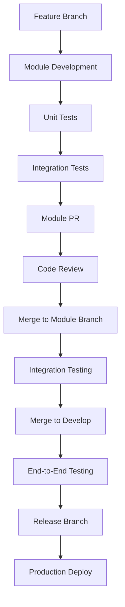
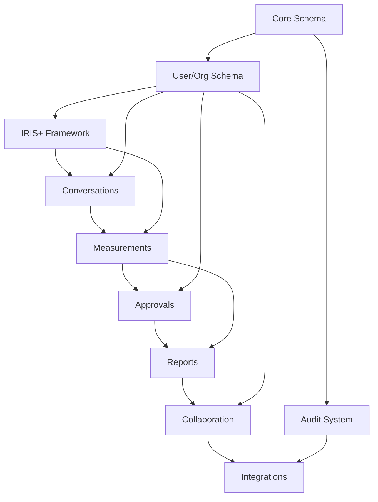
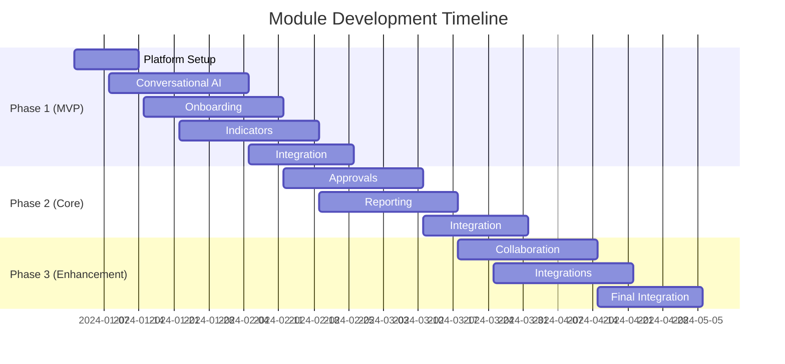

# Modular Development Architecture - Impact Bot v2

## Executive Summary

This document outlines a modular development architecture for Impact Bot v2 that enables concurrent development across multiple teams and features while minimizing merge conflicts and maintaining clear separation of concerns.

## 1. User Story Analysis & Module Grouping

### 1.1 Core Module Breakdown

Based on the comprehensive user stories analysis, the system is organized into **7 primary modules** with clear boundaries:

#### **Module 1: Conversational AI Core**
**User Stories:**
- Conversational Search
- Keyword to IRIS+ Mapping  
- Smart Suggestions
- Conversational Guidance
- Conversational Error Handling
- Smart Follow-ups
- Multilingual Chat Support

**Responsibilities:**
- LLM integration and orchestration
- Natural language processing
- Intent classification and entity extraction
- Conversation state management
- Multi-language support

#### **Module 2: User Onboarding & Discovery**
**User Stories:**
- Onboarding Chat Flow
- Instant Results on First Input
- Guest Mode / Anonymous Trial
- Use Case Templates
- Feature Discovery
- Feedback Collection

**Responsibilities:**
- User journey orchestration
- Template management
- Anonymous session handling
- Progressive disclosure of features

#### **Module 3: Impact Measurement & Data**
**User Stories:**
- Custom Indicator Creation
- Guided Indicator Setup
- IRIS+ Alignment Recommendations
- Real-time Data Entry
- External Data Integration
- Data Validation
- Progress Monitoring

**Responsibilities:**
- Custom indicator lifecycle
- Data collection and validation
- IRIS+ framework integration
- Measurement tracking

#### **Module 4: Approvals & Governance**
**User Stories:**
- Indicator Approval Process
- Approval Notifications
- Approval Prompts
- Role-based Prompting
- Data Sensitivity Prompts
- Inline Chat Audit Trail

**Responsibilities:**
- Approval workflow engine
- Role-based access control
- Audit trail management
- Compliance tracking

#### **Module 5: Reporting & Analytics**
**User Stories:**
- Custom Report Generation
- Grant-Aligned Reporting
- Executive Dashboards
- Shareable Reports & Links
- Custom Workflows

**Responsibilities:**
- Report generation engine
- Dashboard creation
- Export capabilities
- Sharing and permissions

#### **Module 6: Collaboration & Stakeholder Management**
**User Stories:**
- External Evaluator Access
- Funder Portal
- Threaded Comments
- Comment Thread Resolution
- Feedback Collection (stakeholder)

**Responsibilities:**
- External access management
- Comment and feedback systems
- Collaboration workflows
- Stakeholder-specific interfaces

#### **Module 7: Integration & System Management**
**User Stories:**
- External System Connections
- Guided CSV Import via Chat
- External Sync Setup via Chat
- Offline Mode
- Audit Trail (system-level)

**Responsibilities:**
- External system integrations
- File processing and imports
- Offline capabilities
- System monitoring and health

### 1.2 Implementation Priority Mapping

```
Phase 1 (MVP) - Modules 1, 2, 3
├── Conversational AI Core (foundation)
├── User Onboarding & Discovery (user experience)
└── Impact Measurement & Data (core functionality)

Phase 2 (Core Features) - Modules 4, 5
├── Approvals & Governance (workflow)
└── Reporting & Analytics (output)

Phase 3 (Enhancement) - Modules 6, 7
├── Collaboration & Stakeholder Management (external)
└── Integration & System Management (infrastructure)
```

## 2. Shared/Common Components

### 2.1 Cross-Module Dependencies

#### **Shared Database Entities**
```typescript
// Core entities used across modules
- User, Organization, Role (auth & permissions)
- Conversation, ConversationMessage (conversational state)
- IrisKeyIndicator, IrisStrategicGoal (IRIS+ framework)
- AuditLog (system-wide tracking)
```

#### **Shared Services**
```typescript
// services/shared/
├── auth/
│   ├── AuthService.ts          // Authentication logic
│   ├── PermissionService.ts    // RBAC implementation
│   └── SessionService.ts       // Session management
├── iris/
│   ├── IrisSearchService.ts    // IRIS+ framework queries
│   ├── MappingService.ts       // Keyword to IRIS+ mapping
│   └── RecommendationService.ts // AI-powered recommendations
├── llm/
│   ├── LLMService.ts           // LLM API integration
│   ├── ContextService.ts       // Conversation context
│   └── IntentService.ts        // NLP intent classification
├── cache/
│   ├── CacheService.ts         // Redis caching layer
│   └── QueryCacheService.ts    // Database query caching
└── notification/
    ├── NotificationService.ts  // System notifications
    └── EmailService.ts         // Email integration
```

#### **Shared Utilities**
```typescript
// utils/shared/
├── validation/
│   ├── DataValidator.ts        // Input validation
│   └── SchemaValidator.ts      // JSON schema validation
├── export/
│   ├── PDFExporter.ts         // PDF generation
│   ├── ExcelExporter.ts       // Excel export
│   └── CSVExporter.ts         // CSV handling
├── file/
│   ├── FileProcessor.ts       // File upload/processing
│   └── StorageService.ts      // File storage abstraction
└── audit/
    ├── AuditLogger.ts         // Audit trail logging
    └── ChangeTracker.ts       // Entity change tracking
```

### 2.2 Shared Frontend Components

```typescript
// frontend/src/shared/
├── components/
│   ├── ui/                    // Base UI components
│   ├── forms/                 // Reusable form components
│   ├── tables/                // Data table components
│   ├── charts/                // Visualization components
│   └── layout/                // Layout components
├── hooks/
│   ├── useAuth.ts            // Authentication hook
│   ├── usePermissions.ts     // Permission checking
│   ├── useConversation.ts    // Chat state management
│   └── useNotifications.ts   // Notification system
├── store/
│   ├── authSlice.ts          // Auth state
│   ├── conversationSlice.ts  // Chat state
│   ├── uiSlice.ts           // UI state
│   └── cacheSlice.ts        // Client-side cache
└── types/
    ├── api.ts               // API response types
    ├── iris.ts              // IRIS+ framework types
    └── user.ts              // User/org types
```

## 3. API Boundaries Between Modules

### 3.1 RESTful API Design

```typescript
// Module-specific API boundaries
/api/v1/
├── auth/                     // Shared - Authentication
├── conversations/            // Module 1 - Conversational AI
├── onboarding/              // Module 2 - User Discovery
├── indicators/              // Module 3 - Impact Measurement
├── approvals/               // Module 4 - Governance
├── reports/                 // Module 5 - Reporting
├── collaboration/           // Module 6 - Stakeholder Mgmt
└── integrations/            // Module 7 - System Integration
```

### 3.2 Internal Service APIs

```typescript
// Internal service communication
interface ModuleAPIs {
  // Conversational AI Core
  ConversationalAI: {
    analyzeIntent(query: string): Promise<Intent>
    generateResponse(context: ConversationContext): Promise<Response>
    extractEntities(text: string): Promise<Entity[]>
  }
  
  // Impact Measurement
  ImpactMeasurement: {
    createIndicator(data: CustomIndicatorData): Promise<Indicator>
    validateData(measurement: MeasurementData): Promise<ValidationResult>
    calculateProgress(indicatorId: string): Promise<ProgressData>
  }
  
  // Approvals & Governance  
  ApprovalEngine: {
    submitForApproval(item: ApprovableItem): Promise<ApprovalRequest>
    checkPermissions(user: User, resource: Resource): Promise<boolean>
    logAuditEvent(event: AuditEvent): Promise<void>
  }
  
  // Reporting & Analytics
  ReportingEngine: {
    generateReport(config: ReportConfig): Promise<Report>
    createDashboard(spec: DashboardSpec): Promise<Dashboard>
    exportData(format: ExportFormat, data: any): Promise<Buffer>
  }
}
```

### 3.3 Event-Driven Communication

```typescript
// Inter-module event system
interface ModuleEvents {
  // From Conversational AI
  'conversation.intent.classified': { conversationId: string, intent: Intent }
  'conversation.recommendation.generated': { conversationId: string, recommendations: Recommendation[] }
  
  // From Impact Measurement
  'indicator.created': { indicatorId: string, organizationId: string }
  'measurement.submitted': { measurementId: string, indicatorId: string }
  
  // From Approvals
  'approval.requested': { itemId: string, itemType: string, requesterId: string }
  'approval.completed': { itemId: string, status: 'approved' | 'rejected', approverId: string }
  
  // From Reporting
  'report.generated': { reportId: string, organizationId: string }
  'dashboard.shared': { dashboardId: string, sharedWith: string[] }
}
```

## 4. Development Workflow Recommendations

### 4.1 Branch Strategy

```bash
# Main branches
main/                        # Production-ready code
develop/                     # Integration branch
release/v*                   # Release preparation

# Module-specific branches
feature/conversational-ai/*  # Module 1 features
feature/onboarding/*         # Module 2 features  
feature/measurement/*        # Module 3 features
feature/approvals/*          # Module 4 features
feature/reporting/*          # Module 5 features
feature/collaboration/*      # Module 6 features
feature/integration/*        # Module 7 features

# Shared component branches
feature/shared/auth/*        # Shared authentication
feature/shared/ui/*          # Shared UI components
feature/shared/services/*    # Shared services
```

### 4.2 Development Process



### 4.3 Conflict Prevention Strategies

#### **File Ownership Matrix**
```yaml
# .github/CODEOWNERS
# Module 1 - Conversational AI
/backend/src/services/llm/           @ai-team
/backend/src/services/conversation/  @ai-team
/frontend/src/modules/chat/          @ai-team

# Module 2 - Onboarding  
/backend/src/services/onboarding/    @ux-team
/frontend/src/modules/onboarding/    @ux-team

# Module 3 - Impact Measurement
/backend/src/services/indicators/    @measurement-team
/backend/src/services/measurements/  @measurement-team
/frontend/src/modules/indicators/    @measurement-team

# Shared Components
/backend/src/services/shared/        @platform-team
/frontend/src/shared/                @platform-team
/backend/src/prisma/                 @platform-team
```

#### **Database Migration Strategy**
```typescript
// Migration naming convention
// YYYYMMDD_HHMMSS_module_description.sql

// Examples:
20241215_100000_shared_initial_schema.sql
20241215_110000_conversational_ai_conversations.sql  
20241215_120000_measurement_custom_indicators.sql
20241215_130000_approvals_workflow_engine.sql
```

### 4.4 Testing Strategy Per Module

#### **Module 1: Conversational AI Core**
```typescript
// tests/conversational-ai/
├── unit/
│   ├── llm-service.test.ts
│   ├── intent-classifier.test.ts
│   └── context-manager.test.ts
├── integration/
│   ├── conversation-flow.test.ts
│   └── api-endpoints.test.ts
└── e2e/
    └── chat-scenarios.test.ts
```

#### **Module 3: Impact Measurement**  
```typescript
// tests/measurement/
├── unit/
│   ├── indicator-service.test.ts
│   ├── measurement-validator.test.ts
│   └── progress-calculator.test.ts
├── integration/
│   ├── iris-integration.test.ts
│   └── data-pipeline.test.ts
└── performance/
    └── measurement-load.test.ts
```

#### **Shared Component Testing**
```typescript
// tests/shared/
├── auth/
│   ├── auth-service.test.ts
│   └── permission-service.test.ts
├── database/
│   ├── migration.test.ts
│   └── seed.test.ts
└── integration/
    └── module-communication.test.ts
```

## 5. Database Schema Ownership

### 5.1 Module-Specific Tables

```sql
-- Module 1: Conversational AI Core
conversations
conversation_messages  
conversation_recommendations
query_patterns

-- Module 2: User Onboarding & Discovery  
-- (Uses shared user/org tables + conversation tables)

-- Module 3: Impact Measurement & Data
user_custom_indicators
user_measurements
iris_* (all IRIS+ framework tables)

-- Module 4: Approvals & Governance
-- (Extends existing tables with approval fields)
-- approval_workflows (new)
-- approval_requests (new)

-- Module 5: Reporting & Analytics
user_reports
report_templates (new)
dashboard_configs (new)

-- Module 6: Collaboration & Stakeholder Management
external_access_tokens (new)
stakeholder_comments (new) 
comment_threads (new)

-- Module 7: Integration & System Management
data_sync_status
external_connections (new)
import_jobs (new)

-- Shared Tables (Platform Team)
users
organizations
roles
user_organizations
audit_logs
```

### 5.2 Migration Dependencies



## 6. Frontend Component Organization

### 6.1 Module-Based Architecture

```typescript
// frontend/src/
├── modules/
│   ├── conversational-ai/
│   │   ├── components/
│   │   │   ├── ChatInterface.tsx
│   │   │   ├── MessageBubble.tsx
│   │   │   └── RecommendationCard.tsx
│   │   ├── hooks/
│   │   │   ├── useChat.ts
│   │   │   └── useRecommendations.ts
│   │   ├── store/
│   │   │   └── chatSlice.ts
│   │   └── types/
│   │       └── conversation.ts
│   ├── onboarding/
│   │   ├── components/
│   │   │   ├── OnboardingWizard.tsx
│   │   │   ├── QuickStart.tsx
│   │   │   └── TemplateGallery.tsx
│   │   ├── hooks/
│   │   │   └── useOnboarding.ts
│   │   └── store/
│   │       └── onboardingSlice.ts
│   ├── indicators/
│   │   ├── components/
│   │   │   ├── IndicatorBuilder.tsx
│   │   │   ├── MeasurementForm.tsx
│   │   │   └── ProgressDashboard.tsx
│   │   ├── hooks/
│   │   │   ├── useIndicators.ts
│   │   │   └── useMeasurements.ts
│   │   └── store/
│   │       └── indicatorSlice.ts
│   ├── approvals/
│   │   ├── components/
│   │   │   ├── ApprovalQueue.tsx
│   │   │   ├── ApprovalCard.tsx
│   │   │   └── WorkflowStatus.tsx
│   │   ├── hooks/
│   │   │   └── useApprovals.ts
│   │   └── store/
│   │       └── approvalSlice.ts
│   ├── reporting/
│   │   ├── components/
│   │   │   ├── ReportBuilder.tsx
│   │   │   ├── DashboardView.tsx
│   │   │   └── ExportOptions.tsx
│   │   ├── hooks/
│   │   │   ├── useReports.ts
│   │   │   └── useDashboards.ts
│   │   └── store/
│   │       └── reportSlice.ts
│   ├── collaboration/
│   │   ├── components/
│   │   │   ├── CommentThread.tsx
│   │   │   ├── StakeholderPortal.tsx
│   │   │   └── ShareDialog.tsx
│   │   ├── hooks/
│   │   │   └── useCollaboration.ts
│   │   └── store/
│   │       └── collaborationSlice.ts
│   └── integrations/
│       ├── components/
│       │   ├── ConnectionWizard.tsx
│       │   ├── ImportStatus.tsx
│       │   └── SyncSettings.tsx
│       ├── hooks/
│       │   └── useIntegrations.ts
│       └── store/
│           └── integrationSlice.ts
├── shared/
│   ├── components/         # Reusable UI components
│   ├── hooks/             # Cross-module hooks
│   ├── services/          # API clients
│   ├── store/             # Global state
│   ├── types/             # TypeScript definitions
│   └── utils/             # Utility functions
├── layouts/
│   ├── AppLayout.tsx      # Main application layout
│   ├── ChatLayout.tsx     # Chat-focused layout
│   └── DashboardLayout.tsx # Dashboard layout
└── pages/
    ├── Dashboard.tsx      # Main dashboard page
    ├── Chat.tsx           # Chat interface page
    └── Settings.tsx       # Settings page
```

### 6.2 Component Interaction Patterns

```typescript
// Cross-module communication via events
import { useEventBus } from '@/shared/hooks/useEventBus'

// In Indicator Module
const IndicatorForm = () => {
  const { emit } = useEventBus()
  
  const handleSubmit = (indicator) => {
    // Create indicator
    createIndicator(indicator)
    
    // Notify other modules
    emit('indicator.created', { 
      indicatorId: indicator.id,
      organizationId: indicator.organizationId 
    })
  }
}

// In Conversational AI Module  
const ChatInterface = () => {
  const { subscribe } = useEventBus()
  
  useEffect(() => {
    subscribe('indicator.created', (data) => {
      // Update chat context with new indicator
      updateConversationContext({
        type: 'indicator_created',
        data
      })
    })
  }, [])
}
```

## 7. Testing Strategy

### 7.1 Module-Specific Testing

#### **Unit Testing**
```typescript
// Each module maintains its own unit tests
// tests/modules/{module-name}/unit/

// Example: Conversational AI
describe('ConversationalAI', () => {
  describe('IntentClassifier', () => {
    it('should classify user intents correctly', () => {
      // Test intent classification logic
    })
  })
  
  describe('ResponseGenerator', () => {
    it('should generate contextual responses', () => {
      // Test response generation
    })
  })
})
```

#### **Integration Testing**
```typescript
// Cross-module integration tests
// tests/integration/

describe('Module Integration', () => {
  describe('Indicator Creation Flow', () => {
    it('should create indicator and update conversation', async () => {
      // Test full flow across modules
      const indicator = await createIndicator(testData)
      const conversation = await getConversation(conversationId)
      
      expect(conversation.context).toContain(indicator.id)
    })
  })
})
```

#### **End-to-End Testing**
```typescript
// Full user journey tests
// tests/e2e/

describe('User Journeys', () => {
  it('should complete onboarding to first measurement', async () => {
    await page.goto('/onboarding')
    
    // Complete onboarding
    await completeOnboarding()
    
    // Create indicator
    await createCustomIndicator()
    
    // Submit measurement
    await submitMeasurement()
    
    // Verify in dashboard
    await verifyDashboardUpdate()
  })
})
```

### 7.2 Continuous Integration Strategy

```yaml
# .github/workflows/module-tests.yml
name: Module Tests

on:
  pull_request:
    paths:
      - 'backend/src/modules/**'
      - 'frontend/src/modules/**'

jobs:
  test-modules:
    strategy:
      matrix:
        module: [
          conversational-ai,
          onboarding, 
          indicators,
          approvals,
          reporting,
          collaboration,
          integrations
        ]
    
    steps:
      - name: Test Module
        run: |
          npm test -- --testPathPattern=${{ matrix.module }}
          
      - name: Integration Tests
        if: matrix.module == 'indicators'
        run: |
          npm run test:integration -- --module=${{ matrix.module }}
```

## 8. Development Timeline & Team Assignment

### 8.1 Recommended Team Structure

```
Platform Team (2-3 developers)
├── Shared services and infrastructure
├── Database schema and migrations  
├── Authentication and authorization
└── DevOps and deployment

Module Teams (2 developers each)
├── Team 1: Conversational AI Core
├── Team 2: Onboarding & Discovery
├── Team 3: Impact Measurement & Data
├── Team 4: Approvals & Governance
├── Team 5: Reporting & Analytics
└── Team 6: Collaboration & Integration
```

### 8.2 Concurrent Development Schedule



## 9. Monitoring & Maintenance

### 9.1 Module Health Monitoring

```typescript
// Module-specific health checks
interface ModuleHealthCheck {
  module: string
  status: 'healthy' | 'degraded' | 'unhealthy'
  metrics: {
    responseTime: number
    errorRate: number
    throughput: number
  }
  dependencies: string[]
}

// Health check endpoints
GET /health/modules/conversational-ai
GET /health/modules/indicators  
GET /health/modules/approvals
GET /health/modules/reporting
```

### 9.2 Performance Monitoring

```typescript
// Module-specific performance metrics
const moduleMetrics = {
  'conversational-ai': [
    'llm_response_time',
    'intent_classification_accuracy',
    'conversation_completion_rate'
  ],
  'indicators': [
    'indicator_creation_time',
    'measurement_validation_time',
    'iris_mapping_accuracy'
  ],
  'reporting': [
    'report_generation_time',
    'dashboard_load_time',
    'export_success_rate'
  ]
}
```

## 10. Conclusion

This modular architecture enables:

✅ **Concurrent Development**: Teams can work independently on different modules
✅ **Clear Boundaries**: Well-defined API contracts and responsibilities  
✅ **Minimal Conflicts**: File ownership and branch strategies prevent overlaps
✅ **Independent Deployment**: Modules can be deployed and scaled independently
✅ **Maintainable Codebase**: Clear separation of concerns and testing strategies

The architecture supports the full scope of user stories while providing a foundation for long-term scalability and maintainability.