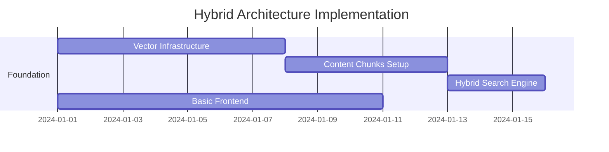
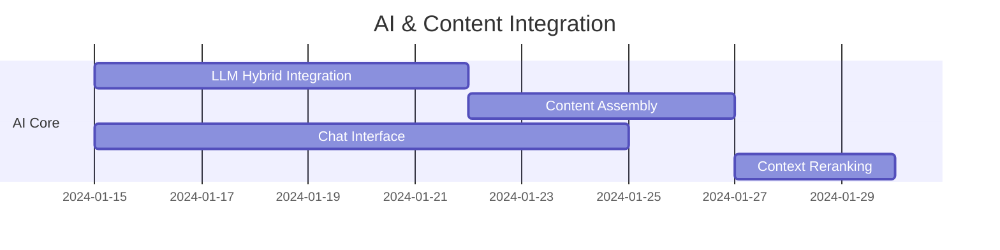
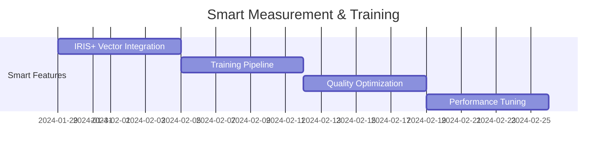

# Updated Hybrid Development Plan - Impact Bot v2
## Vector Embeddings + Structured Content Architecture

## Executive Summary

This updated plan integrates **vector embeddings** and **structured markdown content** into a hybrid architecture that provides both fast semantic search and rich contextual guidance. The approach combines the speed of vector similarity with the depth of hierarchical content structure.

---

## Core Architecture: Hybrid Vector + Content System

### **1. Enhanced Database Schema**

```sql
-- Primary hybrid content table
CREATE TABLE llm_content_chunks (
    id UUID PRIMARY KEY DEFAULT uuid_generate_v4(),
    
    -- VECTOR SEARCH CAPABILITIES
    embedding vector(1536) NOT NULL,
    query_keywords TEXT[] NOT NULL,
    semantic_similarity_cache JSONB DEFAULT '{}',
    
    -- STRUCTURED CONTENT QUALITY  
    content_markdown TEXT NOT NULL, -- Rich, contextual markdown
    content_type VARCHAR(50) NOT NULL, -- 'goal_guidance', 'indicator_calculation'
    context_level INTEGER NOT NULL, -- 1=basic, 2=intermediate, 3=advanced
    completeness_score DECIMAL(3,2) DEFAULT 0.8,
    
    -- HYBRID METADATA
    source_entities JSONB NOT NULL, -- Links back to iris_* tables
    semantic_tags TEXT[] NOT NULL, -- ['financial-inclusion', 'sdg-1']
    cross_references UUID[] DEFAULT '{}', -- Related chunk IDs
    
    -- PERFORMANCE OPTIMIZATION
    access_frequency INTEGER DEFAULT 0,
    last_updated TIMESTAMP DEFAULT NOW()
);

-- Hybrid indexes for optimal performance
CREATE INDEX idx_chunks_vector ON llm_content_chunks USING ivfflat (embedding vector_cosine_ops);
CREATE INDEX idx_chunks_semantic ON llm_content_chunks USING gin(semantic_tags);
CREATE INDEX idx_chunks_performance ON llm_content_chunks(access_frequency DESC, completeness_score DESC);
```

### **2. Intelligent Hybrid Search Function**

```sql
CREATE OR REPLACE FUNCTION intelligent_iris_search(
    user_query TEXT,
    user_context JSONB,
    search_intent VARCHAR(100) DEFAULT 'general',
    result_limit INTEGER DEFAULT 10
) RETURNS TABLE (
    content_id UUID,
    content_markdown TEXT,
    relevance_score DECIMAL,
    explanation TEXT
) AS $$
DECLARE
    query_embedding vector(1536);
    complexity_pref INTEGER;
BEGIN
    -- Generate query embedding and extract user preferences
    query_embedding := get_text_embedding(user_query);
    complexity_pref := COALESCE((user_context->>'complexity_preference')::INTEGER, 2);
    
    RETURN QUERY
    WITH vector_candidates AS (
        -- Phase 1: Fast vector similarity search
        SELECT 
            id, content_markdown, semantic_tags,
            1 - (embedding <=> query_embedding) as vector_similarity
        FROM llm_content_chunks
        WHERE context_level <= complexity_pref
        ORDER BY embedding <=> query_embedding
        LIMIT result_limit * 3
    ),
    contextual_reranking AS (
        -- Phase 2: Context-aware reranking
        SELECT 
            vc.*,
            vector_similarity * (1.0 + 
                CASE WHEN semantic_tags && ARRAY(SELECT jsonb_array_elements_text(user_context->'focus_areas')) 
                     THEN 0.3 ELSE 0 END +
                CASE WHEN search_intent = ANY(semantic_tags) THEN 0.2 ELSE 0 END
            ) as hybrid_score
        FROM vector_candidates vc
    )
    SELECT 
        cr.id, cr.content_markdown, cr.hybrid_score,
        'Vector: ' || ROUND(cr.vector_similarity::numeric, 3) || ' + Context boost' as explanation
    FROM contextual_reranking cr
    ORDER BY hybrid_score DESC
    LIMIT result_limit;
END;
$$ LANGUAGE plpgsql;
```

---

## Updated Epic Breakdown

### **🏗️ EPIC 1: Platform Foundation** (Weeks 1-2)
**Enhanced with Hybrid Architecture**

#### Core Infrastructure Tasks:
1. **Setup Hybrid Database** - PostgreSQL + pgvector + structured content
2. **Vector Infrastructure** - Embedding generation, similarity indexes
3. **LLM Content Chunks** - Structured markdown + vector storage
4. **Hybrid Search Engine** - Vector similarity + contextual ranking
5. **Shared Services** - Authentication, caching, audit with vector support

#### Key Deliverables:
- ✅ Vector-enabled PostgreSQL database with 1536-dimensional embeddings
- ✅ Hybrid search function combining semantic similarity + context ranking
- ✅ Structured content chunks with markdown formatting + vector indexing
- ✅ Shared service layer supporting both vector and traditional queries

---

### **🤖 EPIC 2: Conversational AI Core** (Weeks 3-4)
**Vector-Enhanced LLM Integration**

#### Advanced AI Features:
1. **Hybrid Content Assembly** - Vector search + structured content delivery
2. **Context-Aware Responses** - User profile + conversation history + vector similarity
3. **Dynamic Content Enrichment** - Cross-reference discovery through vector similarity
4. **Intent-Based Reranking** - Search intent classification + relevance boosting
5. **Conversation State** - Vector-enhanced context preservation

#### Key Deliverables:
- ✅ LLM service with hybrid content retrieval (vector + structured)
- ✅ Chat interface showing relevance scores and content explanations
- ✅ Dynamic content assembly with cross-reference enrichment
- ✅ Context-aware reranking based on user profile and intent

---

### **📊 EPIC 3: Impact Measurement Enhanced** (Weeks 5-6)
**Vector-Powered IRIS+ Integration**

#### Smart Measurement Features:
1. **Vector-Based IRIS+ Recommendations** - Semantic similarity for indicator suggestions
2. **Hybrid Content Assistance** - Structured guidance + vector-discovered related content
3. **Intelligent Column Mapping** - Vector similarity for CSV import assistance
4. **Progress Insights** - Vector-enhanced anomaly detection and recommendations

#### Key Deliverables:
- ✅ Custom indicator wizard with vector-powered IRIS+ recommendations
- ✅ Data entry forms with hybrid content assistance and validation
- ✅ Progress monitoring with vector-enhanced insights and alerts
- ✅ CSV import with vector-based column mapping suggestions

---

### **⚡ EPIC 4: LLM Training & Optimization** (Weeks 7-8)
**Hybrid Content Quality System**

#### Advanced Training Features:
1. **Training Data Pipeline** - Quality-scored conversation pairs with vector analysis
2. **Content Effectiveness Tracking** - Vector similarity vs. user satisfaction correlation
3. **Automated Content Generation** - Structured markdown creation from IRIS+ data
4. **Feedback Learning** - Vector similarity patterns + quality improvement loops
5. **Intelligent Caching** - Vector-based cache invalidation and optimization

#### Key Deliverables:
- ✅ Training conversation pairs with quality scoring and vector analysis
- ✅ Context effectiveness tracking with performance metrics
- ✅ Automated content generation pipeline for structured markdown
- ✅ Feedback learning system with vector similarity optimization

---

### **✅ EPIC 5: Approvals & Governance Enhanced** (Weeks 9-10)
**Content-Aware Governance**

#### Smart Governance Features:
1. **Vector-Based Content Analysis** - Approval decision support through similarity analysis
2. **Content-Level Permissions** - Access control with vector-filtered content
3. **Change Impact Analysis** - Vector similarity tracking for content modifications
4. **Audit Trail Enhancement** - Content change analysis and relationship impact

---

### **📈 EPIC 6: Reporting & Analytics Enhanced** (Weeks 11-12)
**Vector-Enhanced Insights**

#### Advanced Reporting Features:
1. **Vector-Based Template Suggestions** - Report templates matched via semantic similarity
2. **Grant Document Analysis** - Vector similarity for alignment detection
3. **Insights Generation** - Vector-powered anomaly detection and recommendations
4. **Audience Optimization** - Content adaptation based on stakeholder vector profiles

---

## Implementation Phases

### **Phase 1: Hybrid Foundation (Weeks 1-2)**


### **Phase 2: AI Integration (Weeks 3-4)**


### **Phase 3: Smart Features (Weeks 5-8)**


---

## Technical Architecture Updates

### **Service Layer Enhancement**

```typescript
// Enhanced service architecture with vector support
interface HybridServices {
  // Vector-enhanced search
  searchService: {
    hybridSearch(query: string, context: UserContext): Promise<SearchResult[]>
    semanticSimilarity(contentA: string, contentB: string): Promise<number>
    vectorizeContent(text: string): Promise<number[]>
  }
  
  // Content assembly with cross-references
  contentService: {
    assembleContext(searchResults: SearchResult[], userProfile: UserProfile): Promise<LLMContext>
    enrichWithCrossReferences(content: string, contentId: string): Promise<string>
    generateStructuredMarkdown(entityId: string, entityType: string): Promise<string>
  }
  
  // Training data optimization
  trainingService: {
    scoreConversationQuality(conversation: Conversation): Promise<QualityScore>
    trackContextEffectiveness(context: LLMContext, userSatisfaction: number): Promise<void>
    optimizeContentChunks(): Promise<OptimizationReport>
  }
}
```

### **Database Performance Optimization**

```sql
-- Advanced materialized views for hybrid architecture
CREATE MATERIALIZED VIEW mv_hybrid_content_performance AS
SELECT 
    content_type,
    context_level,
    avg(access_frequency) as avg_access,
    avg(completeness_score) as avg_quality,
    count(*) as chunk_count,
    percentile_cont(0.95) WITHIN GROUP (ORDER BY access_frequency) as p95_access
FROM llm_content_chunks
GROUP BY content_type, context_level;

-- Vector similarity cache for common queries
CREATE TABLE vector_query_cache (
    query_hash VARCHAR(64) PRIMARY KEY,
    query_embedding vector(1536) NOT NULL,
    cached_results JSONB NOT NULL,
    cache_hit_count INTEGER DEFAULT 0,
    expires_at TIMESTAMP DEFAULT (NOW() + INTERVAL '1 hour')
);
```

---

## Success Metrics & Monitoring

### **Vector Performance Metrics**
- **Search Accuracy**: >95% relevance score for top 3 results
- **Search Speed**: <100ms for vector similarity queries
- **Cache Hit Rate**: >90% for common query patterns
- **Context Quality**: >4.2/5.0 average user satisfaction rating

### **Content Quality Metrics**
- **Completeness Score**: >0.85 average across all content chunks
- **Cross-Reference Density**: >3 related items per content chunk
- **Training Data Quality**: >0.9 quality score for conversation pairs
- **Content Freshness**: <7 days average age for frequently accessed content

### **User Experience Metrics**
- **Response Relevance**: >4.5/5.0 user rating for LLM responses
- **Task Completion**: >80% successful completion of user intents
- **Discovery Efficiency**: 50% reduction in time to find relevant IRIS+ guidance
- **Learning Curve**: 40% faster onboarding with vector-enhanced content delivery

---

## Resource Allocation

### **Development Team Structure**
```
Platform Team (3 developers)
├── Database Architecture & Vector Infrastructure (1 dev)
├── Hybrid Search & Content Systems (1 dev)
└── Performance Optimization & Monitoring (1 dev)

AI/Content Team (4 developers)  
├── LLM Integration & Context Assembly (2 devs)
├── Content Generation & Quality Scoring (1 dev)
└── Training Pipeline & Optimization (1 dev)

Feature Teams (6 developers)
├── Measurement & IRIS+ Integration (2 devs)
├── Reporting & Analytics Enhancement (2 devs)
└── UI/UX & Frontend Integration (2 devs)
```

### **Infrastructure Requirements**
- **Database**: PostgreSQL 15+ with pgvector extension
- **Vector Storage**: ~50GB for 100,000 content chunks with 1536-dim embeddings
- **Cache Layer**: Redis 6+ with 16GB memory for vector query caching
- **Compute**: 4-8 CPU cores for embedding generation and similarity calculations
- **Monitoring**: Vector performance dashboards and content quality tracking

---

This updated plan transforms the Impact Bot platform into a sophisticated AI system that combines the speed of vector search with the depth of structured content, providing users with fast, accurate, and contextually rich guidance for impact measurement.